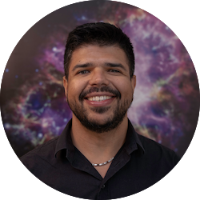

{: style="text-align:center"}

Eu sou um *STScI Fellow* (pós-doutor) no [*Space Telescope Science Institute*](https://www.stsci.edu) e cientista de suporte no time do [instrumento COS](https://www.stsci.edu/hst/instrumentation/cos) no Telescópio Espacial *Hubble*. Meus pronomes são ele/dele.

Meu tópico de pesquisa principal é [detecção e caracterização de planetas extra-solares e suas atmosferas](pesquisa). Eu também tenho interesse em atmosferas estelares e no desenvolvimento de *software* para a comunidade astronômica. Os principais instrumentos que eu uso na minha pesquisa são espectrógrafos de alta resolução em telescópios espaciais e na Terra.

---

Gravações disponíveis em público:

* [*5th NUVA Workshop*, 27 outubro 2020, conferência virtual](https://exoplanet-talks.org/talk/261) (em inglês)
* [*SAG21 Community Symposium*, 9 março 2021, conferência virtual](https://www.youtube.com/watch?v=Tr0ZkuO1sn8) (em inglês)
* [Canal da SAB, bate-papo *live*](https://youtu.be/Go74zYuRTLw)
* [*ExoExplorers program 2022*, 18 fevereiro 2022, seminário virtual](https://www.youtube.com/watch?v=Wo4qDMcohF4) (em inglês)
* [*AAS Journals Author Series*, 18 November 2023](https://www.youtube.com/watch?v=0GRwd6-qF-w) (em inglês)

---

Minha lista completa de publicações pode ser encontrada no [ADS](https://ui.adsabs.harvard.edu/search/q=author%3A%22dos%20Santos%2C%20L.%20A.%22%20AND%20database%3Aastronomy&sort=date%20desc%2C%20bibcode%20desc&p_=0). Aqui vão alguns destaques:

* L. A. Dos Santos, A. A. Vidotto, S. Vissapragada, et al. 2021 [`p-winds`: *an open-source Python code to model planetary outflows and upper atmospheres*](https://ui.adsabs.harvard.edu/abs/2022A%26A...659A..62D/abstract), A&A 659.

* L. A. Dos Santos, D. Ehrenreich, V. Bourrier, et al. 2020, [*The high-energy environment and atmospheric escape of the mini-Neptune K2-18 b*](https://ui.adsabs.harvard.edu/abs/2020A%26A...634L...4D/abstract), A&A Letters 634.

* L. A. Dos Santos, D. Ehrenreich, V. Bourrier, et al. 2019, [*The Hubble PanCET program: an extensive search for metallic ions in the exosphere of GJ 436 b*](https://ui.adsabs.harvard.edu/abs/2019A%26A...629A..47D/abstract), A&A 629.

* L. A. Dos Santos, J. Meléndez, J.-D. do Nascimento, et al. 2016, [*The Sun as a typical rotator and evidence for a new rotational braking law for Sun-like stars*](https://ui.adsabs.harvard.edu/abs/2016A%26A...592A.156D/abstract), A&A 592.

Você também pode me encontrar no <a href="https://orcid.org/0000-0002-2248-3838" target="orcid.widget" rel="noopener noreferrer" style="vertical-align:top;">orcid.org/0000-0002-2248-3838</a>, <a href="https://scholar.google.com/citations?user=qtgZdFIAAAAJ">Google Scholar</a>, e no sistema de [Currículos Lattes](http://lattes.cnpq.br/3229594928172764).

---

Ocasionalmente eu [desenvolvo *software*](https://github.com/ladsantos) em Python e *scripts* para pesquisa astronômica. Aqui vão alguns que eu acho que podem ser úteis para outras pessoas:

* [`p-winds`](https://p-winds.readthedocs.io/): Modelos de vento Parker para atmosferas de exoplanetas. Fique à vontade para [criar um *pull request*](https://github.com/ladsantos/p-winds/pulls) ou [submeter *issues*](https://github.com/ladsantos/p-winds/issues) no GitHub!

* [`stissplice`](https://github.com/ladsantos/stissplice): Conecte ordens espectrais em dados do espectrógrafo STIS.

* [`flatstar`](https://github.com/ladsantos/flatstar): Desenhe trânsitos (exo)planetários.

* [`sunburn`](https://github.com/ladsantos/sunburn): Análise de dados espectrais ultravioleta do telescópio *Hubble*.
