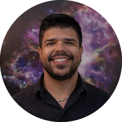

{: style="text-align:center"}

I am an Assistant Astronomer at the [Space Telescope Science Institute](https://www.stsci.edu) working with the [COS instrument](https://www.stsci.edu/hst/instrumentation/cos) team of the *Hubble Space Telescope*. I was born and raised in Brazil and my pronouns are he/him/his 🏳️‍🌈.

My main research topic is the [characterization of extra-solar planets and their atmospheres](research). I am also interested in stellar atmospheres and developing scientific software for the astronomical community. The main instruments I use in my research are high-resolution and/or space-based spectrographs.

---

My talks on public record:

* [5th NUVA Workshop, 27 October 2020, virtual conference](https://exoplanet-talks.org/talk/261)
* [SAG21 Community Symposium, 9 March 2021, virtual conference](https://www.youtube.com/watch?v=Tr0ZkuO1sn8)
* [*Canal da SAB*, live chat/interview](https://youtu.be/Go74zYuRTLw) (in Portuguese)
* [ExoExplorers program 2022, 18 February 2022, virtual seminar](https://www.youtube.com/watch?v=Wo4qDMcohF4)
* [AAS Journals Author Series, 18 November 2023](https://www.youtube.com/watch?v=0GRwd6-qF-w)

---

My full list of publications can be found on [ADS](https://ui.adsabs.harvard.edu/search/q=author%3A%22dos%20Santos%2C%20L.%20A.%22%20AND%20database%3Aastronomy&sort=date%20desc%2C%20bibcode%20desc&p_=0). Here are some highlights:

* L. A. Dos Santos, A. A. Vidotto, S. Vissapragada, et al. 2021 [`p-winds`: an open-source Python code to model planetary outflows and upper atmospheres](https://ui.adsabs.harvard.edu/abs/2022A%26A...659A..62D/abstract), A&A 659.

* L. A. Dos Santos, D. Ehrenreich, V. Bourrier, et al. 2020, [The high-energy environment and atmospheric escape of the mini-Neptune K2-18 b](https://ui.adsabs.harvard.edu/abs/2020A%26A...634L...4D/abstract), A&A Letters 634.

* L. A. Dos Santos, D. Ehrenreich, V. Bourrier, et al. 2019, [The Hubble PanCET program: an extensive search for metallic ions in the exosphere of GJ 436 b](https://ui.adsabs.harvard.edu/abs/2019A%26A...629A..47D/abstract), A&A 629.

* L. A. Dos Santos, J. Meléndez, J.-D. do Nascimento, et al. 2016, [The Sun as a typical rotator and evidence for a new rotational braking law for Sun-like stars](https://ui.adsabs.harvard.edu/abs/2016A%26A...592A.156D/abstract), A&A 592.

You can also look me up on <a href="https://orcid.org/0000-0002-2248-3838" target="orcid.widget" rel="noopener noreferrer" style="vertical-align:top;">orcid.org/0000-0002-2248-3838</a> and <a href="https://scholar.google.com/citations?user=qtgZdFIAAAAJ">Google Scholar</a>.

---

Occasionally I [write software](https://github.com/ladsantos) in Python and scripts for astronomical research. Here are some that I think could be useful for you:

* [`p-winds`](https://p-winds.readthedocs.io/): Isothermal Parker wind models for upper atmospheres of planets. Feel free to [create a pull request](https://github.com/ladsantos/p-winds/pulls) or [submit issues](https://github.com/ladsantos/p-winds/issues) on GitHub!

* [`stissplice`](https://github.com/ladsantos/stissplice): Splice echelle spectra from STIS.

* [`flatstar`](https://github.com/ladsantos/flatstar): Draw (exo)planetary transits.

* [`sunburn`](https://github.com/ladsantos/sunburn): Data analysis package of HST far-UV spectra.
